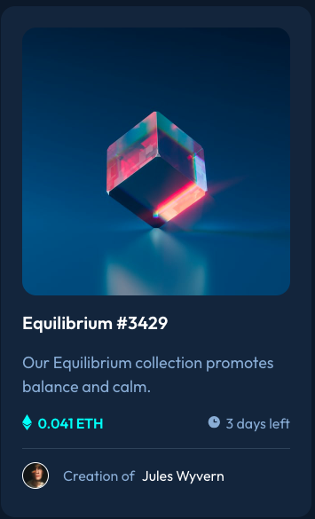
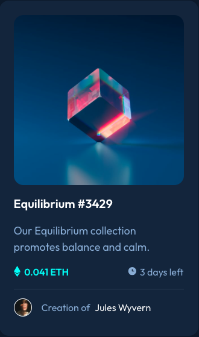
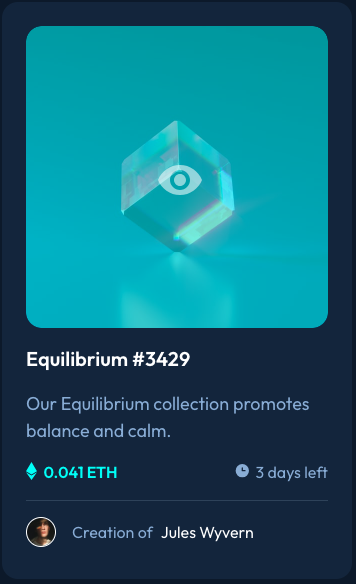

# Frontend Mentor - NFT preview card component solution

This is a solution to the [NFT preview card component challenge on Frontend Mentor](https://www.frontendmentor.io/challenges/nft-preview-card-component-SbdUL_w0U). Frontend Mentor challenges help you improve your coding skills by building realistic projects.

## Table of contents

- [Overview](#overview)
  - [The challenge](#the-challenge)
  - [Screenshot](#screenshot)
  - [Links](#links)
- [My process](#my-process)
  - [Built with](#built-with)
  - [What I learned](#what-i-learned)
  - [Continued development](#continued-development)
- [Author](#author)

## Overview

### The challenge

Users should be able to:

- View the optimal layout depending on their device's screen size
- See hover states for interactive elements

### Screenshot

#### Desktop version

  

#### Mobile version

  

#### When hovered

  

### Links

- Solution URL: [Github](https://github.com/Mafilala/NFT-preview-card-component)
- Live Site URL: [Netlify](https://loquacious-cajeta-6e5c3f.netlify.app/)

## My process

### Built with

- Semantic HTML5 markup
- CSS custom properties
- Flexbox
- CSS Grid

### What I learned

I refreshed my memory of css pseudo selector

### Continued development

I'm just a newbie, what else can i say.

## Author

- Frontend Mentor - [@Mafilala](https://www.frontendmentor.io/profile/Mafilala)
